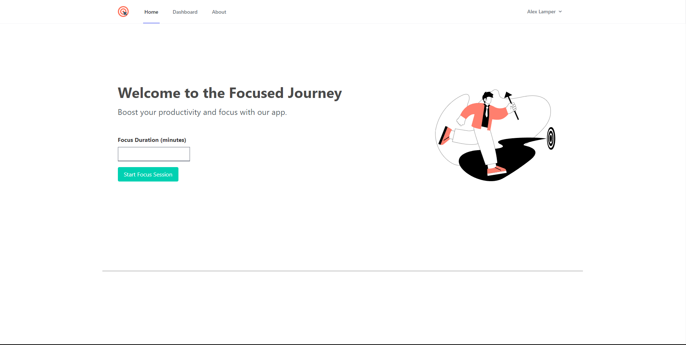

# Focused Journey

> Welcome to Focused Journey. Focused Journey is an online platform/web application made with the goal to help people focus on their tasks, study longer, work without distraction and more!

## General Information
The Focused Journey website is a web application made usign Laravel. It provides focus sessions for users to create to their own desire, from changing the font to the background image.

## Technologies Used
- Laravel
- Blade
- Bootstrap
- Bulma
- CSS
- Laravel Breeze
- Vite

## Pages
1. **Home**: The home page includes an input where you can enter the amount of minutes you want the focus session to be.

2. **Dashboard**: The dashboard provides an overview of things you've achieved, completed, added, etc...

3. **About**: See what Focused Journey is about, how it works, why it is made, and more!

4. **Profile**: Take a look at your account profile (only available when logged in). You can view and edit your account information here.

5. **Login/Register**: The login and register pages are simple pages where the user can log into the application using an email and password.

## Features
- Clean and intuitive UI
- Responsive design for optimal viewing on various devices
- Interactive forms working with database/backend
- Authentication functionality for login, logout and registration

## Screenshots
*Here is a screenshot of the home page. Also want to see the other pages? See the 'screenshots' folder.*

## Project Status
The application is live and maintained to ensure the website is up to date and available.
- [focusedjourney.xyz](https://www.focusedjourney.xyz) - click to visit the website.

## License
This project is licensed under the [WTFPL License](LICENSE).

## Acknowledgements
- The Laravel Framework
- All used Libraries and technologies noted in the 'Technologies Used' 

## Contact
Have questions about the product, development or are you interested in a partnership?
Don't hesitate to shoot me a message:
Discord: alexlamper_
Mail: devlamper06@gmail.com

Created by [@AlexLamper](https://github.com/AlexLamper) - feel free to star this repository!

